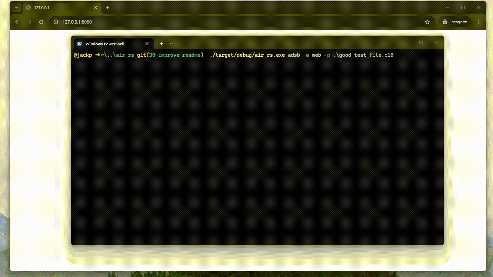
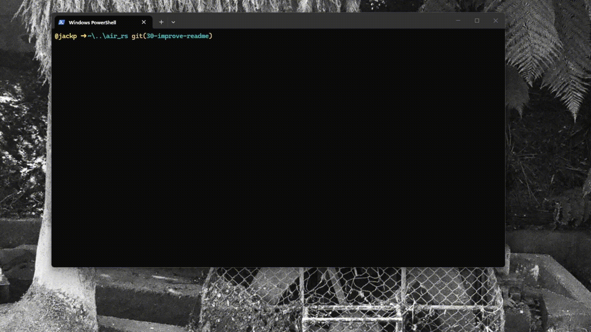

# AIR_RS

This project provides a suite of common applications utilising software defined radios (sdr).
This is intended to be an all in one program that allows the users to use
an sdr with minimal setup. The key differentiator from programs like sdr++ being that you just start the program and go no plugins needed. 

Currently the program supports:

- ADS-B, stream, interactive tui and a web ui.

The planned features are:

- Maritime Shipping 
- Weather sats NOAA etc. 
- Aviation Communications Radios

## ADSB
### ADSB Web GUI

This UI lets the user view all information about specific transponder devices as well as view there location on a minimalistic UI. The web application written in typescript communicates with the main program over a web socket where serialised packet information is sent directly to it. The web application handles all packet matching to an individual devices itself to reduce the load on the receiver (main rust) program.



The web gui can be run from adsb_frontend using:

```
npm install
```

```
npm run build
```

```
npm run dev
```

### ADSB Terminal Interface Interactive



The terminal interface interactive mode displays the currently received transponders in an updating table format. This displays information collated from several different packets that all relate to a single device in a simple and easy to see way.


### ADSB Terminal Interface Stream 

The terminal interface stream mode displays the raw decoded packets as they are received directly to the user in a scrolling stream. This mode is intended to allow other programs that cannot use the web sockets for the GUI to interact with the program. 

## Usage

The program can be run using:

```bash
cargo run help
```

from the root directory.

## Architecture

### ADS-B

The main rust program works using three threads:

1. A thread that handles receiving data from the sdr.
2. A thread that handles converting that data from complex frequency values to bits then into the adsbpacket struct.
3. The display thread which serves the data to the user using several different methods.

These threads can then be swapped out based on the ui and processing methods needed.

## Reference Material

This project is based on several reference materials:

- https://github.com/rsadsb/dump1090_rs
- https://github.com/kevinmehall/rust-soapysdr
- https://github.com/ccostes/rtl-sdr-rs
